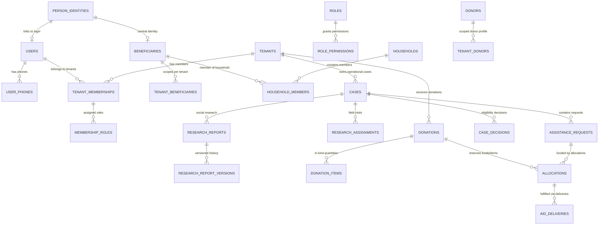

# الوثيقة المعمارية ومخطط علاقات الكيانات (SANAD Architecture & ERD - Sprint 1)

## 1. مخطط الكيانات والعلاقات (Entity-Relationship Diagram - Mermaid)

```mermaid
erDiagram
    PERSON_IDENTITIES ||--o| USERS : "links to login"
    PERSON_IDENTITIES ||--o| BENEFICIARIES : "central identity"
    USERS ||--o{ USER_PHONES : "has phones"
    USERS ||--o{ TENANT_MEMBERSHIPS : "belongs to tenants"
    TENANTS ||--o{ TENANT_MEMBERSHIPS : "has members"
    TENANT_MEMBERSHIPS ||--o{ MEMBERSHIP_ROLES : "assigned roles"
    ROLES ||--o{ ROLE_PERMISSIONS : "grants permissions"
    BENEFICIARIES ||--o{ TENANT_BENEFICIARIES : "scoped per tenant"
    BENEFICIARIES ||--o{ HOUSEHOLD_MEMBERS : "member of household"
    HOUSEHOLDS ||--o{ HOUSEHOLD_MEMBERS : "contains members"
    TENANTS ||--o{ CASES : "owns operational cases"
    CASES ||--o{ ASSISTANCE_REQUESTS : "contains requests"
    CASES ||--o{ RESEARCH_ASSIGNMENTS : "field visits"
    CASES ||--o{ RESEARCH_REPORTS : "social research"
    RESEARCH_REPORTS ||--o{ RESEARCH_REPORT_VERSIONS : "versioned history"
    CASES ||--o{ CASE_DECISIONS : "eligibility decisions"
    DONORS ||--o{ TENANT_DONORS : "scoped donor profile"
    TENANTS ||--o{ DONATIONS : "receives donations"
    DONATIONS ||--o{ DONATION_ITEMS : "in-kind quantities"
    DONATIONS ||--o{ ALLOCATIONS : "reserves funds/items"
    ASSISTANCE_REQUESTS ||--o{ ALLOCATIONS : "funded by allocations"
    ALLOCATIONS ||--o{ AID_DELIVERIES : "fulfilled via deliveries"
```
